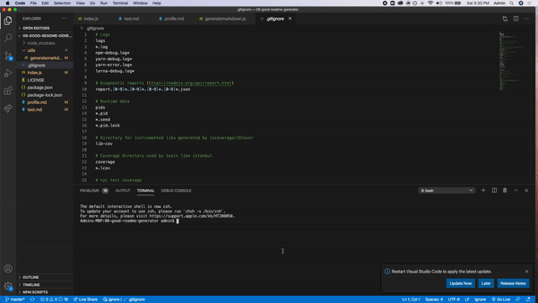

# 08-good-readme-generator

### USAGE

### It's a node app that is a simple program used to generate readme's 

AS A developer

### I WANT a README generator

SO THAT can quickly create a professional README for a new project
Acceptance criteria
GIVEN a command-line application that accepts user input
WHEN I am prompted for information about my application repository
THEN a quality, professional README.md is generated with the title of your project and sections entitled Description, Table of Contents, Installation, Usage, License, Contributing, Tests, and Questions
WHEN I enter my project title
THEN this is displayed as the title of the README
WHEN I enter a description, installation instructions, usage information, contribution guidelines, and test instructions
THEN this information is added to the sections of the README entitled Description, Installation, Usage, Contributing, and Tests
WHEN I choose a license for my application from a list of options
THEN a badge for that license is added hear the top of the README and a notice is added to the section of the README entitled License that explains which license the application is covered under
WHEN I enter my GitHub username
THEN this is added to the section of the README entitled Questions, with a link to my GitHub profile
WHEN I enter my email address
THEN this is added to the section of the README entitled Questions, with instructions on how to reach me with additional questions
WHEN I click on the links in the Table of Contents
THEN I am taken to the corresponding section of the README
## Table of Contents
* [Installation](#installation)
* [Usage](#usage)
* [License](#license)
* [Questions](#questions)
* [Review](#review)
## Installation 
Clone my repository. Install dependencies

```
git clone
yarn install
``` 

## Usage 

To start 

```
node index.js
```
Look at video for further instructions:
https://drive.google.com/file/d/1dbAv2Tl9N7bIAk72j8YG-gKxkX1f5uLM/view?usp=sharing

 

 


## Contributing 
 None 
 
## License 

 Licensed under MIT License. 
 
## Tests 
 None
 
## Questions 
 You can see more of my Projects on my [GitHub profile](https://github.com/mrjohnsonpham) 

 Contact [mrjohnsonpham](mailto:mrjohnsonpham@gmail.com) 
 
## Review 

  * Here is this repo link: https://github.com/mrjohnsonpham/08-good-readme-generator
 
  * Link: application is not deployed
